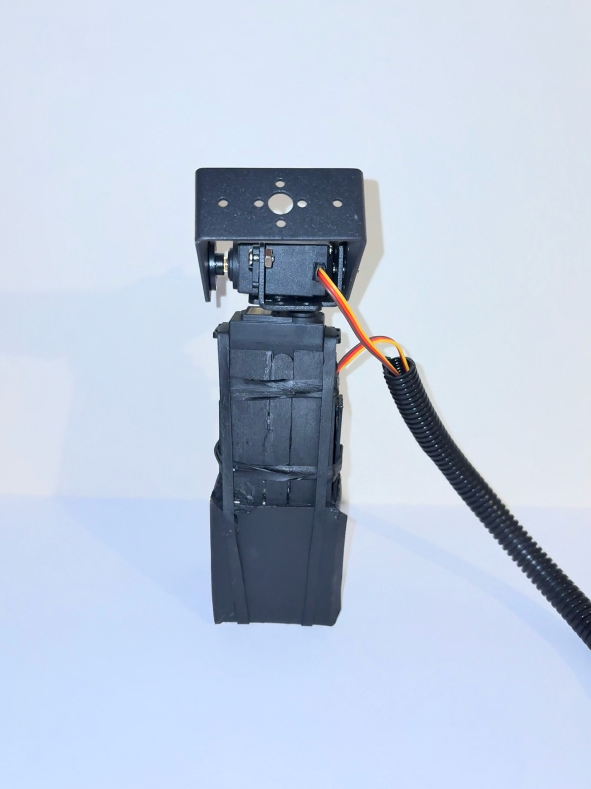
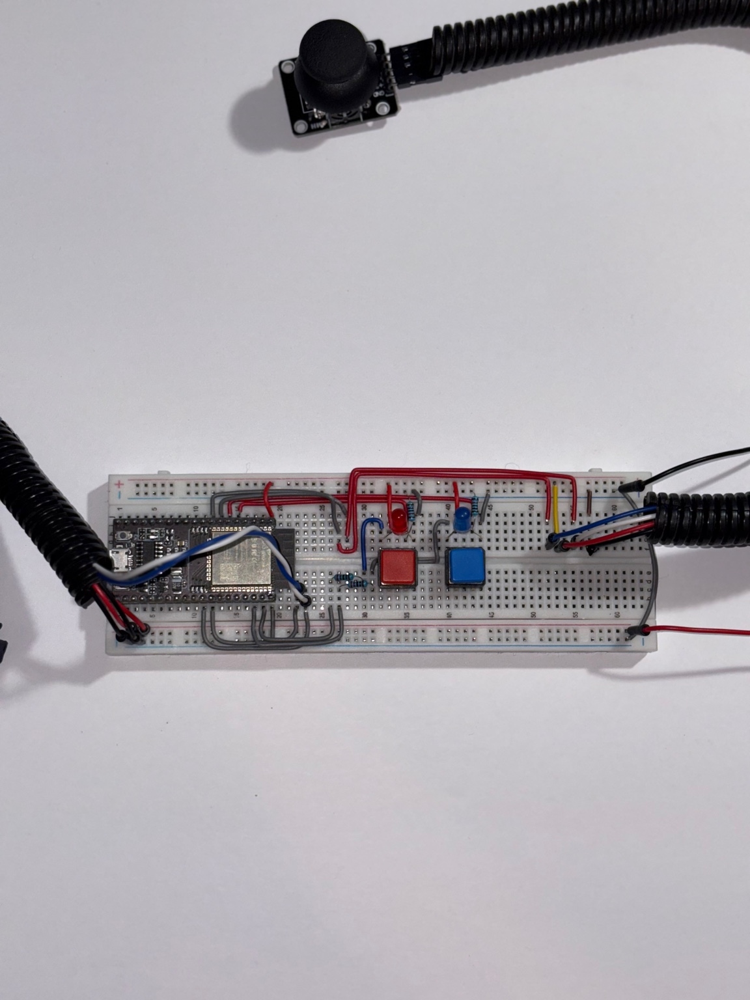
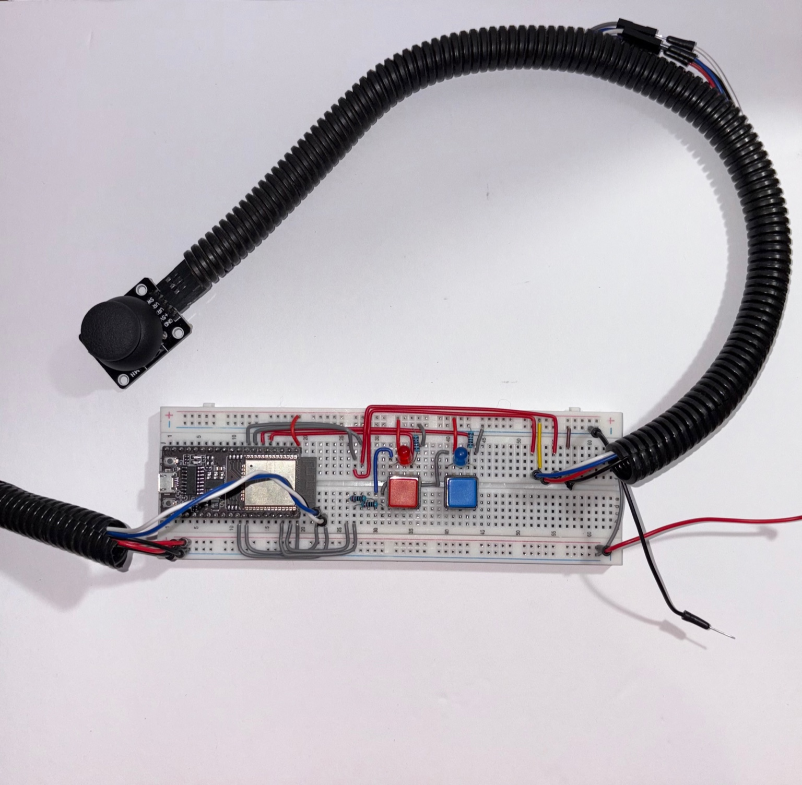

# Turret Control Project

This project demonstrates a head-tracking turret inspired by the F-35 Lightning II’s helmet display system — combining computer vision, networking, and embedded real-time control on the ESP32.

Built with **ESP-IDF + FreeRTOS** on the ESP32, the system integrates:  
- **Inputs** → joystick (local) or computer vision (remote via WebSocket)  
- **Processing** → filtering, deadzone handling, and failover logic  
- **Outputs** → servo-driven pan-tilt turret with LED indicators  

Pairs with my **computer vision frontend repo**:  
[project-turret-head-control](https://github.com/Alexander-v22/project-turret-head-control)  

- **Frontend (Head Control Repo)** → Tracks head position using computer vision and sends yaw/pitch via WebSocket  
- **Backend (This Repo)** → Receives data, drives servos, ensures safe & responsive control  

Together, these repos demonstrate **end-to-end system design**: computer vision, networking, and embedded real-time actuation.  

## Hardware Photos

  
  
  
  

---

## Demo

| Turret Sweep | Joystick Control | WebSocket Control |
|--------------|-----------------|-------------------|
| (Insert GIF here) | (Insert GIF here) | (Insert GIF here) |

Video Walkthrough: [YouTube Demo](https://youtu.be/your-demo-link)

---

## Purpose

The goal of this project is to design a **modular, real-time embedded control system** for vision-guided robotics.  
While simplified, it explores the same concept as the F-35’s HMDS: translating human head motion into **precise servo actuation** for targeting and interaction.  

Key objectives included:  
- Hands-on experience with **ESP-IDF** and embedded C  
- Practicing **real-time scheduling and concurrency** with FreeRTOS  
- Implementing **servo control and filtering techniques** (PWM, EMA, deadzones)  
- Developing a **scalable firmware architecture** for future extensions  

---

## Features

- **Joystick Mode** → Local manual control with filtering, deadzone handling, and calibration  
- **WebSocket Mode** → Low-latency remote control, paired with computer vision frontend  
- **Mode Switching & Failover** → Hardware buttons toggle source; automatic fallback to joystick if WebSocket drops  
- **Real-Time Responsiveness** → FreeRTOS tasks ensure smooth, non-blocking control  
- **Modular Design** → Separate layers for input handling, networking, servo drivers, and scheduling  

---

## Technical Highlights

- **Servo Control** → Dual-axis PWM via ESP32 LEDC @ 50 Hz with safe clamping  
- **Joystick Input** → 12-bit ADC reads with exponential moving average (EMA) filtering and nonlinear response curve  
- **Networking** → ESP32 in Wi-Fi Station mode, onboard WebSocket server for real-time control packets  
- **Failover Logic** → Timeout detection reverts to joystick mode automatically  
- **FreeRTOS Integration** → Task scheduling for responsive updates without blocking networking  

---

## What I Learned

- Designing a **real-time control system** from hardware pins up to networking protocols  
- Applying **signal processing** (EMA filters, deadzones, nonlinear response curves) for stability  
- Managing **concurrency & responsiveness** with FreeRTOS tasks  
- Bridging **computer vision inputs with embedded actuation** for human-guided robotics  
- Presenting technical work in a way that’s clear to both engineers and recruiters  

---

## Impact & Applications

This project demonstrates how **computer vision and embedded systems** can be combined to create responsive, human-guided robotics.  

Applications include:  
- **Defense & Aerospace** → Inspired by the F-35 HMDS, showing how head-tracking can guide sensors or weapons  
- **Surveillance & Security** → Remote-operated pan-tilt turrets for cameras and sensors  
- **Human-Robot Interaction** → Head or gesture-controlled robotic platforms  
- **Research & Prototyping** → A testbed for experimenting with real-time control, filtering, and embedded networking  

By completing this project, I demonstrated not just the hardware and firmware design, but also the ability to **integrate computer vision with embedded real-time actuation** — a foundation for more advanced robotic systems.  

---

## Technical Documentation

For full engineering details — including **BOM, pinout, calibration, modes, FreeRTOS tasks, WebSocket schema, safety notes, and troubleshooting** — see the dedicated [TECHNICAL_README.md](./TECHNICAL_README.md).

## Author

**Alexander Valdovinos Mena**

